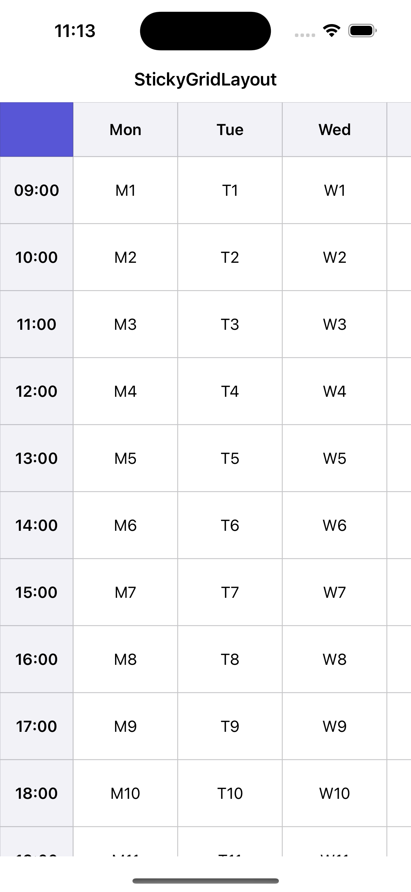
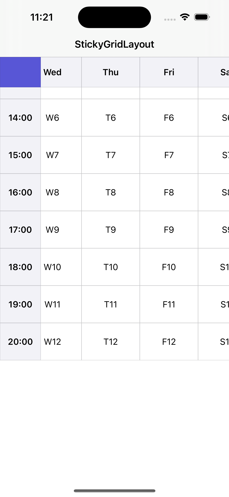

# StickyGridLayout

A spreadsheet-style `UICollectionViewLayout` with frozen header rows and columns — like *freeze panes* in a spreadsheet. Any number of leading rows and columns stay pinned while the body scrolls freely in both directions.

| Initial | Scrolled — headers stay frozen |
|---|---|
|  |  |

*The top row and left column stay pinned while the body scrolls in both directions. See [`Example/`](Example) for the full demo app.*

## Features

- **Freeze any number of rows and columns**, not just one — set `stickyRowCount` / `stickyColumnCount`.
- **Data-driven sizing** via an optional delegate; falls back to sensible defaults.
- **Cheap scrolling** — cell frames are built once and only the frozen cells are re-pinned on scroll, instead of recomputing the whole grid every frame.
- **UIKit-free geometry core** (`GridGeometry`) that is unit-tested independently of any running collection view.
- **No dependencies.** SPM, CocoaPods, and Carthage.

## Requirements

- iOS 12.0+ / tvOS 12.0+
- Swift 5.7+

## Installation

### Swift Package Manager

```swift
.package(url: "https://github.com/MingFengHo/StickyGridLayout.git", from: "1.0.0")
```

### CocoaPods

```ruby
pod 'StickyGridLayout'
```

### Carthage

```
github "MingFengHo/StickyGridLayout"
```

## Usage

The layout maps **each section to a row** and **each item to a column**. Rows
`0..<stickyRowCount` freeze to the top; columns `0..<stickyColumnCount` freeze to
the left. So a standard data source drives it — no special cell types required.

```swift
import StickyGridLayout

let layout = StickyGridLayout()
layout.stickyRowCount = 1       // freeze the top row  (default: 1)
layout.stickyColumnCount = 1    // freeze the left column (default: 1)
layout.delegate = self

collectionView.collectionViewLayout = layout
```

Provide sizes through the delegate (both methods are optional):

```swift
extension MyViewController: StickyGridLayoutDelegate {
    func stickyGridLayout(_ layout: StickyGridLayout, widthForColumn column: Int) -> CGFloat {
        column == 0 ? 120 : 80   // wider first column for row labels
    }

    func stickyGridLayout(_ layout: StickyGridLayout, heightForRow row: Int) -> CGFloat {
        row == 0 ? 56 : 44       // taller header row
    }
}
```

Without a delegate, every cell uses `layout.defaultColumnWidth` (100) and
`layout.defaultRowHeight` (44).

## How it works

Freezing is done in two passes:

1. **Build (once per data/config change).** `GridGeometry` turns the per-column
   widths and per-row heights into cumulative offsets and an absolute frame for
   every cell, and assigns a z-index so the frozen corner draws above the frozen
   headers, which draw above the body.
2. **Pin (on every scroll).** Only the frozen cells are repositioned: a frozen
   column has its `x` glued to `contentOffset.x`, a frozen row has its `y` glued
   to `contentOffset.y`, and the corner is glued on both axes. The body cells are
   never touched, so scroll cost is independent of grid size.

Keeping that math in a plain `struct` with no UIKit import means it can be
exercised directly in unit tests — see `Tests/StickyGridLayoutTests`.

## Example app

A runnable demo lives in [`Example/`](Example). The Xcode project is generated
from [`project.yml`](Example/project.yml) with [XcodeGen](https://github.com/yonaskolb/XcodeGen):

```sh
cd Example
xcodegen generate
open StickyGridLayoutDemo.xcodeproj
```

## License

StickyGridLayout is available under the MIT license. See [LICENSE](LICENSE).
