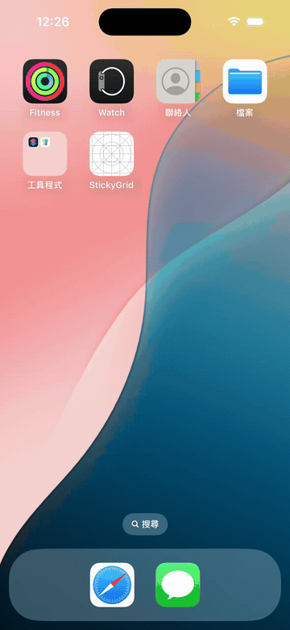

# StickyGridLayout

[English](README.md) · **繁體中文**

一個試算表風格的 `UICollectionViewLayout`，可凍結表頭列與表頭欄 —— 就像試算表的「凍結窗格」。任意數量的起始列與欄會固定不動，內容區則能在水平與垂直兩個方向自由捲動。

<p align="center">
  
</p>

*頂端列與最左欄保持凍結，內容區可雙向捲動。完整示範 app 見 [`Example/`](Example)。*

## 特色

- **可凍結任意數量的列與欄**，不限於一列一欄 —— 用 `stickyRowCount` / `stickyColumnCount` 設定。
- **資料驅動的尺寸**，透過選用的 delegate 提供；未實作時採用預設值。
- **選用的自適應大小** —— 欄與列會自動撐大以容納內容。
- **UIKit 與 SwiftUI 皆可** —— 直接用 layout，或用 `StickyGrid` SwiftUI view（iOS 16+）。
- **捲動成本低** —— 儲存格框架只在資料變動時建立一次，捲動時只重新定位被凍結的儲存格，而非每一幀重算整個表格。
- **不依賴 UIKit 的幾何核心**（`GridGeometry`），可獨立於執行中的 collection view 進行單元測試。
- **零相依**。支援 SPM、CocoaPods、Carthage。

## 系統需求

- iOS 12.0+ / tvOS 12.0+（UIKit）· `StickyGrid` SwiftUI view 需 iOS 16.0+
- Swift 5.7+

## 安裝

### Swift Package Manager

```swift
.package(url: "https://github.com/MingFengHo/StickyGridLayout.git", from: "1.0.0")
```

### CocoaPods

```ruby
pod 'StickyGridLayout'
```

### Carthage

```
github "MingFengHo/StickyGridLayout"
```

## 使用方式

此 layout 將**每個 section 視為一列（row）**、**每個 item 視為一欄（column）**。
第 `0..<stickyRowCount` 列凍結於頂端；第 `0..<stickyColumnCount` 欄凍結於左側。
因此用標準的 data source 即可驅動，不需要特殊的 cell 類型。

```swift
import StickyGridLayout

let layout = StickyGridLayout()
layout.stickyRowCount = 1       // 凍結頂端一列（預設：1）
layout.stickyColumnCount = 1    // 凍結左側一欄（預設：1）
layout.delegate = self

collectionView.collectionViewLayout = layout
```

透過 delegate 提供尺寸（兩個方法皆為選用）：

```swift
extension MyViewController: StickyGridLayoutDelegate {
    func stickyGridLayout(_ layout: StickyGridLayout, widthForColumn column: Int) -> CGFloat {
        column == 0 ? 120 : 80   // 第一欄較寬，放列標題
    }

    func stickyGridLayout(_ layout: StickyGridLayout, heightForRow row: Int) -> CGFloat {
        row == 0 ? 56 : 44       // 表頭列較高
    }
}
```

未設定 delegate 時，每個儲存格採用 `layout.defaultColumnWidth`（100）與
`layout.defaultRowHeight`（44）。

### 自適應欄寬與列高

設定 `isSelfSizing`，即可讓每一欄依內容撐寬、每一列依內容撐高（透過 Auto Layout
量測），不必自己指定尺寸：

```swift
layout.isSelfSizing = true
layout.estimatedColumnWidth = 90   // 起始寬度；欄只會變寬不會變窄
layout.estimatedRowHeight = 44
```

你的 cell 必須能自撐 —— 內容需要有能同時定義寬與高的 Auto Layout 約束（例如把
label 貼齊 `contentView` 的四個邊），並覆寫 `preferredLayoutAttributesFitting`
以回報內容寬度：

```swift
override func preferredLayoutAttributesFitting(
    _ layoutAttributes: UICollectionViewLayoutAttributes
) -> UICollectionViewLayoutAttributes {
    let attributes = super.preferredLayoutAttributesFitting(layoutAttributes)
    attributes.frame.size = contentView.systemLayoutSizeFitting(UIView.layoutFittingCompressedSize)
    return attributes
}
```

每一欄取其最寬儲存格的寬度、每一列取其最高儲存格的高度。尺寸是在儲存格出現時
量測、且只增不減，因此給一個接近實際的 `estimated…` 值能讓捲動時的版面更穩定。
自適應資料表範例見 [`Example/`](Example)。

## SwiftUI

`StickyGrid` 把 layout 橋接到 SwiftUI。以索引定位每個儲存格並回傳一個 view；
欄與列預設會依內容自適應。需要 **iOS 16**（UIKit layout 本身仍支援 iOS 12）。

```swift
import StickyGridLayout

StickyGrid(rows: cities.count + 1, columns: 5,
           stickyRows: 1, stickyColumns: 1) { row, column in
    Text(value(row, column))
        .padding(.horizontal, 14).padding(.vertical, 12)
        .frame(maxWidth: .infinity, maxHeight: .infinity)
        .background(background(row, column))
}
```

## 運作原理

凍結分兩個階段完成：

1. **建立（每次資料／設定變動時一次）。** `GridGeometry` 將各欄寬與各列高換算成
   累積偏移量，並算出每個儲存格的絕對框架，同時指派 z-index，讓凍結的角落顯示於
   凍結表頭之上、凍結表頭又顯示於內容之上。
2. **釘位（每次捲動時）。** 只重新定位被凍結的儲存格：凍結欄的 `x` 貼齊
   `contentOffset.x`、凍結列的 `y` 貼齊 `contentOffset.y`、角落則兩軸都貼齊。
   內容儲存格完全不動，因此捲動成本與表格大小無關。

把這套數學放在一個沒有 import UIKit 的純 `struct` 裡，代表它可以直接在單元測試中
驗證 —— 見 [`Tests/StickyGridLayoutTests`](Tests/StickyGridLayoutTests)。

## 示範 app

可執行的示範位於 [`Example/`](Example)。Xcode 專案由
[`project.yml`](Example/project.yml) 透過 [XcodeGen](https://github.com/yonaskolb/XcodeGen) 產生：

```sh
cd Example
xcodegen generate
open StickyGridLayoutDemo.xcodeproj
```

## 授權

StickyGridLayout 採用 MIT 授權。詳見 [LICENSE](LICENSE)。
